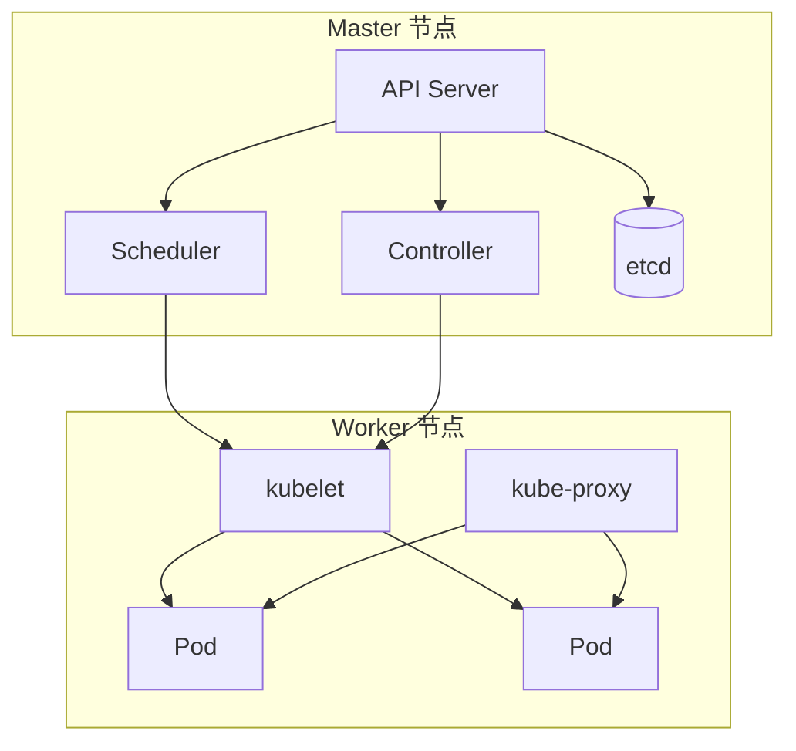

<div translate-x--15>

# Kubernetes 核心概念

From Architecture to Practice

<div mt-8 text-sm opacity-50>
  技术分享 · 2026.03.28
</div>

</div>

<div abs-br m-6 flex flex-col text-right text-sm opacity-50>
  <span>From Architecture to Practice</span>
</div>

---
layout: section
glowSeed: 200
---

# 本期内容

<div grid grid-cols-2 gap-8 pt-8>
  <div flex flex-col gap-4>
    <div border="2 solid violet-800/50" rounded-lg>
      <div flex items-center bg="violet-800/30" px-3 py-2 text-violet-300>
        <div i-carbon:network-4 text-sm mr-2 />
        <div text-xs><em>01 核心架构组件</em></div>
      </div>
    </div>
    <div border="2 solid blue-800/50" rounded-lg>
      <div flex items-center bg="blue-800/30" px-3 py-2 text-blue-300>
        <div i-carbon:container-services text-sm mr-2 />
        <div text-xs><em>02 工作负载资源</em></div>
      </div>
    </div>
    <div border="2 solid cyan-800/50" rounded-lg>
      <div flex items-center bg="cyan-800/30" px-3 py-2 text-cyan-300>
        <div i-carbon:load-balancer-global text-sm mr-2 />
        <div text-xs><em>03 服务发现与负载均衡</em></div>
      </div>
    </div>
  </div>
  <div flex flex-col gap-4>
    <div border="2 solid green-800/50" rounded-lg>
      <div flex items-center bg="green-800/30" px-3 py-2 text-green-300>
        <div i-carbon:data-volume text-sm mr-2 />
        <div text-xs><em>04 存储管理</em></div>
      </div>
    </div>
    <div border="2 solid orange-800/50" rounded-lg>
      <div flex items-center bg="orange-800/30" px-3 py-2 text-orange-300>
        <div i-carbon:settings text-sm mr-2 />
        <div text-xs><em>05 配置与密钥</em></div>
      </div>
    </div>
    <div border="2 solid pink-800/50" rounded-lg>
      <div flex items-center bg="pink-800/30" px-3 py-2 text-pink-300>
        <div i-carbon:locked text-sm mr-2 />
        <div text-xs><em>06 元数据与权限</em></div>
      </div>
    </div>
  </div>
</div>

---
layout: two-cols
glow: right
glowSeed: 220
---

# 集群架构概览

Kubernetes 集群由 **Master** 节点和 **Worker** 节点组成

<div flex flex-col gap-3 mt-4>
  <div border="2 solid violet-800/50" rounded-lg>
    <div flex items-center bg="violet-800/30" px-3 py-2 text-violet-300>
      <div i-carbon:server-proxy text-sm mr-2 />
      <div text-xs><em>Master — 集群大脑，管理和决策</em></div>
    </div>
  </div>
  <div border="2 solid blue-800/50" rounded-lg>
    <div flex items-center bg="blue-800/30" px-3 py-2 text-blue-300>
      <div i-carbon:virtual-machine text-sm mr-2 />
      <div text-xs><em>Node — 集群工人，运行业务应用</em></div>
    </div>
  </div>
  <div border="2 solid cyan-800/50" rounded-lg>
    <div flex items-center bg="cyan-800/30" px-3 py-2 text-cyan-300>
      <div i-carbon:database text-sm mr-2 />
      <div text-xs><em>etcd — 键值数据库，保存所有状态</em></div>
    </div>
  </div>
  <div border="2 solid green-800/50" rounded-lg>
    <div flex items-center bg="green-800/30" px-3 py-2 text-green-300>
      <div i-carbon:container text-sm mr-2 />
      <div text-xs><em>容器运行时 — Docker、containerd</em></div>
    </div>
  </div>
</div>

::right::



---
layout: section
glowSeed: 280
---

# 01

核心架构组件

---
class: py-10
clicks: 4
glow: right
glowSeed: 300
---

# Master 组件

<div flex flex-col gap-4 mt-6>
  <div
    v-click="1"
    transition duration-500 ease-in-out
    :class="$clicks < 1 ? 'opacity-0 translate-y-5' : 'opacity-100 translate-y-0'"
    border="2 solid cyan-800/50" rounded-lg
  >
    <div flex items-center bg="cyan-800/30" px-4 py-2 text-cyan-300>
      <div i-carbon:api text-sm mr-2 />
      <div text-sm><em>API Server</em></div>
    </div>
    <div bg="cyan-800/10" px-4 py-3 text-sm>集群入口门户，所有操作都通过它</div>
  </div>
  <div
    v-click="2"
    transition duration-500 ease-in-out
    :class="$clicks < 2 ? 'opacity-0 translate-y-5' : 'opacity-100 translate-y-0'"
    border="2 solid violet-800/50" rounded-lg
  >
    <div flex items-center bg="violet-800/30" px-4 py-2 text-violet-300>
      <div i-carbon:task-scheduler text-sm mr-2 />
      <div text-sm><em>Scheduler</em></div>
    </div>
    <div bg="violet-800/10" px-4 py-3 text-sm>调度器，决定 Pod 运行在哪个节点</div>
  </div>
  <div
    v-click="3"
    transition duration-500 ease-in-out
    :class="$clicks < 3 ? 'opacity-0 translate-y-5' : 'opacity-100 translate-y-0'"
    border="2 solid fuchsia-800/50" rounded-lg
  >
    <div flex items-center bg="fuchsia-800/30" px-4 py-2 text-fuchsia-300>
      <div i-carbon:sync text-sm mr-2 />
      <div text-sm><em>Controller</em></div>
    </div>
    <div bg="fuchsia-800/10" px-4 py-3 text-sm>控制器，确保实际状态向期望状态靠拢</div>
  </div>
  <div
    v-click="4"
    transition duration-500 ease-in-out
    :class="$clicks < 4 ? 'opacity-0 translate-y-5' : 'opacity-100 translate-y-0'"
    border="2 solid orange-800/50" rounded-lg
  >
    <div flex items-center bg="orange-800/30" px-4 py-2 text-orange-300>
      <div i-carbon:database text-sm mr-2 />
      <div text-sm><em>etcd</em></div>
    </div>
    <div bg="orange-800/10" px-4 py-3 text-sm>键值数据库，保存所有集群数据</div>
  </div>
</div>

<!--
API Server 接收请求 → etcd 保存数据 → Controller 监听变化 → Scheduler 选择节点
-->

---
class: py-10
glowSeed: 330
---

# Master 工作流程

````md magic-move {lines: true}
```yaml {*|1-4}
# 用户提交 Deployment
apiVersion: apps/v1
kind: Deployment
metadata:
  name: nginx
```

```yaml {5-10|*}
spec:
  replicas: 3
  selector:
    matchLabels:
      app: nginx
  template:
    metadata:
      labels:
        app: nginx
```

```yaml {11-15|*}
    spec:
      containers:
      - name: nginx
        image: nginx:1.21
        ports:
        - containerPort: 80
```
````

---
layout: section
glowSeed: 360
---

# 02

工作负载资源

---
layout: center
class: text-center
glowSeed: 380
---

# Pod — 最小部署单元

<div text-7xl my-8>
  <div i-carbon:container-services />
</div>

Kubernetes 中最小的部署单元，一个或多个容器的组合

<div grid grid-cols-2 gap-8 pt-8 text-left mx-20>
  <div border="2 solid blue-800/50" rounded-lg p-5 bg="blue-500/10">
    <div text-sm>
      - **共享网络**：同一 Pod 内容器共享网络命名空间<br>
      - **共享存储**：可以挂载共享卷
    </div>
  </div>
  <div border="2 solid green-800/50" rounded-lg p-5 bg="green-500/10">
    <div text-sm>
      - **同生共死**：一起调度、一起销毁<br>
      - **类比**：一个"逻辑主机"
    </div>
  </div>
</div>

---
class: py-10
clicks: 2
glowSeed: 400
---

## Pod 定义与多容器模式

<div grid grid-cols-2 gap-8>
  <div
    v-click="1"
    transition duration-500 ease-in-out
    :class="$clicks < 1 ? 'opacity-0' : 'opacity-100'"
  >

### 单容器 Pod

```yaml {1-5|7-10|all}{lines:true}
apiVersion: v1
kind: Pod
metadata:
  name: web-pod
  labels:
    app: web
spec:
  containers:
  - name: nginx
    image: nginx:1.21
    ports:
    - containerPort: 80
```

  </div>
  <div
    v-click="2"
    transition duration-500 ease-in-out
    :class="$clicks < 2 ? 'opacity-0' : 'opacity-100'"
  >

### 多容器 Pod

```yaml {monaco}
apiVersion: v1
kind: Pod
metadata:
  name: multi-container-pod
spec:
  containers:
  - name: app
    image: myapp:v1
  - name: log-agent
    image: fluentd:v1
    volumeMounts:
    - name: log-volume
      mountPath: /var/log
  volumes:
  - name: log-volume
    emptyDir: {}
```

  </div>
</div>

---
class: py-10
clicks: 2
glowSeed: 420
---

## Deployment vs StatefulSet

<div grid grid-cols-2 gap-8 mt-6>
  <div
    v-click="1"
    transition duration-500 ease-in-out
    :class="$clicks < 1 ? 'opacity-0' : 'opacity-100'"
    class="border-2 border-blue-500/30 rounded-lg p-5 bg-blue-500/10"
  >
    <div text-xl font-bold mb-3 text-blue-300>Deployment</div>
    <div text-sm mb-3>无状态应用管理</div>
    <div text-sm space-y-1>
      - ✅ 副本数可伸缩<br>
      - ✅ 滚动更新<br>
      - ✅ Pod 身份不固定<br>
      - ✅ 适合 Web 服务、API
    </div>
  </div>
  <div
    v-click="2"
    transition duration-500 ease-in-out
    :class="$clicks < 2 ? 'opacity-0' : 'opacity-100'"
    class="border-2 border-green-500/30 rounded-lg p-5 bg-green-500/10"
  >
    <div text-xl font-bold mb-3 text-green-300>StatefulSet</div>
    <div text-sm mb-3>有状态应用管理</div>
    <div text-sm space-y-1>
      - ✅ 稳定的网络标识<br>
      - ✅ 持久化存储<br>
      - ✅ 有序部署和扩展<br>
      - ✅ 适合数据库、缓存
    </div>
  </div>
</div>

---
glowSeed: 440
---

## 其他工作负载类型

<div grid grid-cols-4 gap-6 pt-8>
  <div text-center>
    <div flex items-center justify-center mb-4>
      <div i-carbon:repeat text-5xl text-violet-400 />
    </div>
    <div font-bold mb-1>DaemonSet</div>
    <div text-sm opacity-70>每个节点运行<br>一个 Pod 副本</div>
  </div>
  <div text-center>
    <div flex items-center justify-center mb-4>
      <div i-carbon:task text-5xl text-blue-400 />
    </div>
    <div font-bold mb-1>Job</div>
    <div text-sm opacity-70>一次性任务<br>完成后退出</div>
  </div>
  <div text-center>
    <div flex items-center justify-center mb-4>
      <div i-carbon:time text-5xl text-cyan-400 />
    </div>
    <div font-bold mb-1>CronJob</div>
    <div text-sm opacity-70>定时任务<br>按计划周期执行</div>
  </div>
  <div text-center>
    <div flex items-center justify-center mb-4>
      <div i-carbon:copy text-5xl text-green-400 />
    </div>
    <div font-bold mb-1>ReplicaSet</div>
    <div text-sm opacity-70>维持指定数量<br>Pod 副本</div>
  </div>
</div>

---
layout: section
glowSeed: 460
---

# 03

服务发现与负载均衡

---
class: py-10
clicks: 4
glowSeed: 480
---

# Service 核心概念

将一组 Pod 暴露为**网络服务**的抽象方式

<div flex flex-col gap-3 mt-4>
  <div
    v-click="1"
    transition duration-500 ease-in-out
    :class="$clicks < 1 ? 'opacity-0 translate-y-5' : 'opacity-100 translate-y-0'"
    border="2 solid blue-800/50" rounded-lg
  >
    <div flex items-center bg="blue-800/30" px-4 py-2 text-blue-300>
      <div i-carbon:locked text-sm mr-2 />
      <div text-sm><em>固定入口 — Pod IP 会变化，Service 提供稳定访问点</em></div>
    </div>
  </div>
  <div
    v-click="2"
    transition duration-500 ease-in-out
    :class="$clicks < 2 ? 'opacity-0 translate-y-5' : 'opacity-100 translate-y-0'"
    border="2 solid violet-800/50" rounded-lg
  >
    <div flex items-center bg="violet-800/30" px-4 py-2 text-violet-300>
      <div i-carbon:scale text-sm mr-2 />
      <div text-sm><em>负载均衡 — 自动将请求分发到后端 Pod</em></div>
    </div>
  </div>
  <div
    v-click="3"
    transition duration-500 ease-in-out
    :class="$clicks < 3 ? 'opacity-0 translate-y-5' : 'opacity-100 translate-y-0'"
    border="2 solid cyan-800/50" rounded-lg
  >
    <div flex items-center bg="cyan-800/30" px-4 py-2 text-cyan-300>
      <div i-carbon:search text-sm mr-2 />
      <div text-sm><em>服务发现 — 通过 DNS 名称访问服务</em></div>
    </div>
  </div>
  <div
    v-click="4"
    transition duration-500 ease-in-out
    :class="$clicks < 4 ? 'opacity-0 translate-y-5' : 'opacity-100 translate-y-0'"
    border="2 solid green-800/50" rounded-lg
  >
    <div flex items-center bg="green-800/30" px-4 py-2 text-green-300>
      <div i-carbon:link text-sm mr-2 />
      <div text-sm><em>解耦 — 前端不需要知道后端 Pod 的具体 IP</em></div>
    </div>
  </div>
</div>

---
glowSeed: 500
---

## Service 类型对比

<div grid grid-cols-2 gap-6 mt-6>
  <div border="2 solid blue-800/50" rounded-lg>
    <div flex items-center bg="blue-800/30" px-4 py-2 text-blue-300>
      <div i-carbon:enterprise text-sm mr-2 />
      <div text-sm><em>ClusterIP</em></div>
    </div>
    <div bg="blue-800/10" px-4 py-3 text-sm>集群内部访问，默认类型</div>
  </div>
  <div border="2 solid violet-800/50" rounded-lg>
    <div flex items-center bg="violet-800/30" px-4 py-2 text-violet-300>
      <div i-carbon:ip-address text-sm mr-2 />
      <div text-sm><em>NodePort</em></div>
    </div>
    <div bg="violet-800/10" px-4 py-3 text-sm>节点IP:端口，开发测试用</div>
  </div>
  <div border="2 solid cyan-800/50" rounded-lg>
    <div flex items-center bg="cyan-800/30" px-4 py-2 text-cyan-300>
      <div i-carbon:load-balancer-global text-sm mr-2 />
      <div text-sm><em>LoadBalancer</em></div>
    </div>
    <div bg="cyan-800/10" px-4 py-3 text-sm>外部负载均衡，生产环境用</div>
  </div>
  <div border="2 solid green-800/50" rounded-lg>
    <div flex items-center bg="green-800/30" px-4 py-2 text-green-300>
      <div i-carbon:earth text-sm mr-2 />
      <div text-sm><em>ExternalName</em></div>
    </div>
    <div bg="green-800/10" px-4 py-3 text-sm>外部域名映射，访问外部服务</div>
  </div>
</div>

---
glowSeed: 520
---

# Ingress — 七层路由

管理集群外部访问集群内部服务的 API 对象

<div grid grid-cols-2 gap-8 mt-6>
  <div flex flex-col gap-3>
    <div border="2 solid violet-800/50" rounded-lg>
      <div flex items-center bg="violet-800/30" px-3 py-2 text-violet-300>
        <div i-carbon:globe text-sm mr-2 />
        <div text-xs><em>7层负载：基于域名、URL 路由</em></div>
      </div>
    </div>
    <div border="2 solid cyan-800/50" rounded-lg>
      <div flex items-center bg="cyan-800/30" px-3 py-2 text-cyan-300>
        <div i-carbon:locked text-sm mr-2 />
        <div text-xs><em>SSL 终止：统一处理 HTTPS 证书</em></div>
      </div>
    </div>
    <div border="2 solid blue-800/50" rounded-lg>
      <div flex items-center bg="blue-800/30" px-3 py-2 text-blue-300>
        <div i-carbon:home text-sm mr-2 />
        <div text-xs><em>虚拟主机：一个 IP 托管多个服务</em></div>
      </div>
    </div>
  </div>

```yaml {monaco}
apiVersion: networking.k8s.io/v1
kind: Ingress
metadata:
  name: web-ingress
  annotations:
    cert-manager.io/cluster-issuer: "letsencrypt-prod"
spec:
  ingressClassName: nginx
  tls:
  - hosts:
    - example.com
    secretName: web-tls
  rules:
  - host: example.com
    http:
      paths:
      - path: /
        pathType: Prefix
        backend:
          service:
            name: web-service
            port:
              number: 80
```

</div>

---
layout: section
glowSeed: 540
---

# 04

存储管理

---
class: py-10
clicks: 4
glow: right
glowSeed: 560
---

# 存储核心概念

<div flex flex-col gap-4 mt-6>
  <div
    v-click="1"
    transition duration-500 ease-in-out
    :class="$clicks < 1 ? 'opacity-0 translate-y-5' : 'opacity-100 translate-y-0'"
    border="2 solid cyan-800/50" rounded-lg
  >
    <div flex items-center bg="cyan-800/30" px-4 py-2 text-cyan-300>
      <div i-carbon:folder text-sm mr-2 />
      <div text-sm><em>Volume</em></div>
    </div>
    <div bg="cyan-800/10" px-4 py-3 text-sm>Pod 内容器共享的存储目录</div>
  </div>
  <div
    v-click="2"
    transition duration-500 ease-in-out
    :class="$clicks < 2 ? 'opacity-0 translate-y-5' : 'opacity-100 translate-y-0'"
    border="2 solid violet-800/50" rounded-lg
  >
    <div flex items-center bg="violet-800/30" px-4 py-2 text-violet-300>
      <div i-carbon:database text-sm mr-2 />
      <div text-sm><em>PV（持久卷）</em></div>
    </div>
    <div bg="violet-800/10" px-4 py-3 text-sm>管理员准备的存储资源</div>
  </div>
  <div
    v-click="3"
    transition duration-500 ease-in-out
    :class="$clicks < 3 ? 'opacity-0 translate-y-5' : 'opacity-100 translate-y-0'"
    border="2 solid fuchsia-800/50" rounded-lg
  >
    <div flex items-center bg="fuchsia-800/30" px-4 py-2 text-fuchsia-300>
      <div i-carbon:request-quote text-sm mr-2 />
      <div text-sm><em>PVC（持久卷声明）</em></div>
    </div>
    <div bg="fuchsia-800/10" px-4 py-3 text-sm>用户对存储的申请</div>
  </div>
  <div
    v-click="4"
    transition duration-500 ease-in-out
    :class="$clicks < 4 ? 'opacity-0 translate-y-5' : 'opacity-100 translate-y-0'"
    border="2 solid orange-800/50" rounded-lg
  >
    <div flex items-center bg="orange-800/30" px-4 py-2 text-orange-300>
      <div i-carbon:category text-sm mr-2 />
      <div text-sm><em>StorageClass</em></div>
    </div>
    <div bg="orange-800/10" px-4 py-3 text-sm>存储类型模板，动态创建 PV</div>
  </div>
</div>

---
glowSeed: 580
---

## StorageClass 动态供给

定义存储的类型模板，实现 PV 的动态创建

<div grid grid-cols-2 gap-8 mt-6>
  <div flex flex-col gap-3>
    <div border="2 solid green-800/50" rounded-lg>
      <div flex items-center bg="green-800/30" px-3 py-2 text-green-300>
        <div i-carbon:renew text-sm mr-2 />
        <div text-xs><em>按需创建：PVC 时自动创建 PV</em></div>
      </div>
    </div>
    <div border="2 solid blue-800/50" rounded-lg>
      <div flex items-center bg="blue-800/30" px-3 py-2 text-blue-300>
        <div i-carbon:box text-sm mr-2 />
        <div text-xs><em>类型定义：关联 SSD、HDD 等存储</em></div>
      </div>
    </div>
    <div border="2 solid orange-800/50" rounded-lg>
      <div flex items-center bg="orange-800/30" px-3 py-2 text-orange-300>
        <div i-carbon:trash-can text-sm mr-2 />
        <div text-xs><em>回收策略：Delete 或 Retain</em></div>
      </div>
    </div>
  </div>

```yaml {monaco}
apiVersion: storage.k8s.io/v1
kind: StorageClass
metadata:
  name: fast-ssd
provisioner: kubernetes.io/aws-ebs
parameters:
  type: io1
  iopsPerGB: "10"
  fsType: ext4
reclaimPolicy: Delete
volumeBindingMode: WaitForFirstConsumer
allowVolumeExpansion: true
```

</div>

---
layout: section
glowSeed: 600
---

# 05

配置与密钥

---
class: py-10
clicks: 2
glowSeed: 620
---

## ConfigMap vs Secret

<div grid grid-cols-2 gap-8>
  <div
    v-click="1"
    transition duration-500 ease-in-out
    :class="$clicks < 1 ? 'opacity-0' : 'opacity-100'"
    class="border-2 border-blue-500/30 rounded-lg p-5 bg-blue-500/10"
  >
    <div text-xl font-bold mb-3 text-blue-300>ConfigMap</div>
    <div text-sm mb-3>非敏感配置数据</div>
    <div text-xs opacity-70>
      - 配置文件内容<br>
      - 环境变量<br>
      - 命令行参数<br>
      - 明文存储
    </div>
  </div>
  <div
    v-click="2"
    transition duration-500 ease-in-out
    :class="$clicks < 2 ? 'opacity-0' : 'opacity-100'"
    class="border-2 border-red-500/30 rounded-lg p-5 bg-red-500/10"
  >
    <div text-xl font-bold mb-3 text-red-300>Secret</div>
    <div text-sm mb-3>敏感信息数据</div>
    <div text-xs opacity-70>
      - 密码、Token<br>
      - SSH 密钥<br>
      - OAuth 令牌<br>
      - Base64 编码
    </div>
  </div>
</div>

---
glowSeed: 640
---

# ConfigMap 与 Secret 使用

<div grid grid-cols-2 gap-8 mt-4>

```yaml {monaco}
# 创建 ConfigMap
apiVersion: v1
kind: ConfigMap
metadata:
  name: app-config
data:
  app.properties: |
    server.port=8080
    server.address=0.0.0.0
  database.url: "postgresql://db:5432/mydb"
---
# 在 Pod 中使用
apiVersion: v1
kind: Pod
metadata:
  name: config-pod
spec:
  containers:
  - name: app
    image: myapp:v1
    envFrom:
    - configMapRef:
        name: app-config
```

```yaml {monaco}
# 创建 Secret
apiVersion: v1
kind: Secret
metadata:
  name: db-secret
type: Opaque
data:
  username: YWRtaW4=
  password: cGFzc3dvcmQ=
---
# 在 Pod 中使用
apiVersion: v1
kind: Pod
metadata:
  name: secret-pod
spec:
  containers:
  - name: app
    image: myapp:v1
    env:
    - name: DB_USERNAME
      valueFrom:
        secretKeyRef:
          name: db-secret
          key: username
```

</div>

---
layout: section
glowSeed: 660
---

# 06

元数据与权限

---
class: py-10
clicks: 4
glowSeed: 680
---

# Namespace 资源隔离

在同一个物理集群内实现资源隔离的虚拟集群

<div flex flex-col gap-3 mt-4>
  <div
    v-click="1"
    transition duration-500 ease-in-out
    :class="$clicks < 1 ? 'opacity-0 translate-y-5' : 'opacity-100 translate-y-0'"
    border="2 solid violet-800/50" rounded-lg
  >
    <div flex items-center bg="violet-800/30" px-4 py-2 text-violet-300>
      <div i-carbon:building text-sm mr-2 />
      <div text-sm><em>环境隔离：dev、test、prod 环境分开</em></div>
    </div>
  </div>
  <div
    v-click="2"
    transition duration-500 ease-in-out
    :class="$clicks < 2 ? 'opacity-0 translate-y-5' : 'opacity-100 translate-y-0'"
    border="2 solid blue-800/50" rounded-lg
  >
    <div flex items-center bg="blue-800/30" px-4 py-2 text-blue-300>
      <div i-carbon:group text-sm mr-2 />
      <div text-sm><em>团队隔离：不同团队使用不同命名空间</em></div>
    </div>
  </div>
  <div
    v-click="3"
    transition duration-500 ease-in-out
    :class="$clicks < 3 ? 'opacity-0 translate-y-5' : 'opacity-100 translate-y-0'"
    border="2 solid cyan-800/50" rounded-lg
  >
    <div flex items-center bg="cyan-800/30" px-4 py-2 text-cyan-300>
      <div i-carbon:chart-bar text-sm mr-2 />
      <div text-sm><em>资源配额：限制每个 Namespace 的资源使用</em></div>
    </div>
  </div>
  <div
    v-click="4"
    transition duration-500 ease-in-out
    :class="$clicks < 4 ? 'opacity-0 translate-y-5' : 'opacity-100 translate-y-0'"
    border="2 solid green-800/50" rounded-lg
  >
    <div flex items-center bg="green-800/30" px-4 py-2 text-green-300>
      <div i-carbon:locked text-sm mr-2 />
      <div text-sm><em>访问控制：针对 Namespace 设置权限</em></div>
    </div>
  </div>
</div>

---
glowSeed: 700
---

# RBAC 权限模型

<div grid grid-cols-2 gap-8 mt-6>
  <div flex flex-col gap-3>
    <div border="2 solid violet-800/50" rounded-lg>
      <div flex items-center bg="violet-800/30" px-3 py-2 text-violet-300>
        <div i-carbon:user-role text-sm mr-2 />
        <div text-xs><em>Role — 命名空间内权限</em></div>
      </div>
    </div>
    <div border="2 solid blue-800/50" rounded-lg>
      <div flex items-center bg="blue-800/30" px-3 py-2 text-blue-300>
        <div i-carbon:enterprise text-sm mr-2 />
        <div text-xs><em>ClusterRole — 集群级别权限</em></div>
      </div>
    </div>
    <div border="2 solid cyan-800/50" rounded-lg>
      <div flex items-center bg="cyan-800/30" px-3 py-2 text-cyan-300>
        <div i-carbon:link text-sm mr-2 />
        <div text-xs><em>RoleBinding — 绑定角色到用户</em></div>
      </div>
    </div>
    <div border="2 solid green-800/50" rounded-lg>
      <div flex items-center bg="green-800/30" px-3 py-2 text-green-300>
        <div i-carbon:earth text-sm mr-2 />
        <div text-xs><em>ClusterRoleBinding — 绑定集群角色</em></div>
      </div>
    </div>
  </div>

```yaml {monaco}
# 定义 Role
apiVersion: rbac.authorization.k8s.io/v1
kind: Role
metadata:
  name: pod-reader
rules:
- apiGroups: [""]
  resources: ["pods"]
  verbs: ["get", "watch", "list"]
---
# 绑定到用户
apiVersion: rbac.authorization.k8s.io/v1
kind: RoleBinding
metadata:
  name: read-pods
subjects:
- kind: User
  name: jane
  apiGroup: rbac.authorization.k8s.io
roleRef:
  kind: Role
  name: pod-reader
  apiGroup: rbac.authorization.k8s.io
```

</div>

---
layout: section
glowSeed: 720
---

# 典型工作流程

---
layout: center
class: text-center
glowSeed: 750
---

# 部署一个应用的完整流程

<div mt-10>

````md magic-move {lines: true}
```yaml {1-5}
# 1. 创建 Deployment
apiVersion: apps/v1
kind: Deployment
metadata:
  name: web-app
```

```yaml {6-12}
spec:
  replicas: 3
  selector:
    matchLabels:
      app: web
  template:
    metadata:
      labels:
        app: web
```

```yaml {13-21}
    spec:
      containers:
      - name: nginx
        image: nginx:1.21
        ports:
        - containerPort: 80
        env:
        - name: DB_HOST
          valueFrom:
            configMapKeyRef:
              name: app-config
              key: database.url
```

```yaml {22-32}
# 2. 创建 Service
apiVersion: v1
kind: Service
metadata:
  name: web-service
spec:
  selector:
    app: web
  ports:
  - port: 80
    targetPort: 80
  type: ClusterIP
```
````

</div>

---
layout: quote
glowSeed: 770
---

> Kubernetes 让开发者专注于应用本身，而不是基础设施的复杂性。

— K8s 设计理念

---
layout: section
glowSeed: 790
---

# 核心概念回顾

---
glowSeed: 810
---

## 核心概念回顾

<div grid grid-cols-4 gap-8 pt-8>
  <div text-center>
    <div flex items-center justify-center mb-4>
      <div i-carbon:network-4 text-5xl text-violet-400 />
    </div>
    <div font-bold mb-2>架构</div>
    <div text-sm opacity-70>Master + Node<br>控制与工作分离</div>
  </div>
  <div text-center>
    <div flex items-center justify-center mb-4>
      <div i-carbon:container-services text-5xl text-blue-400 />
    </div>
    <div font-bold mb-2>工作负载</div>
    <div text-sm opacity-70>Pod、Deployment<br>StatefulSet</div>
  </div>
  <div text-center>
    <div flex items-center justify-center mb-4>
      <div i-carbon:load-balancer-global text-5xl text-cyan-400 />
    </div>
    <div font-bold mb-2>网络</div>
    <div text-sm opacity-70>Service、Ingress<br>服务发现</div>
  </div>
  <div text-center>
    <div flex items-center justify-center mb-4>
      <div i-carbon:data-volume text-5xl text-green-400 />
    </div>
    <div font-bold mb-2>存储</div>
    <div text-sm opacity-70>PV、PVC<br>StorageClass</div>
  </div>
</div>

---
layout: end
glowSeed: 830
---

# 感谢观看

<div text-5xl my-8>
  <div i-carbon:thumbs-up />
</div>

<div mt-8 opacity-50>
  技术分享 · 2026.03.28
</div>
