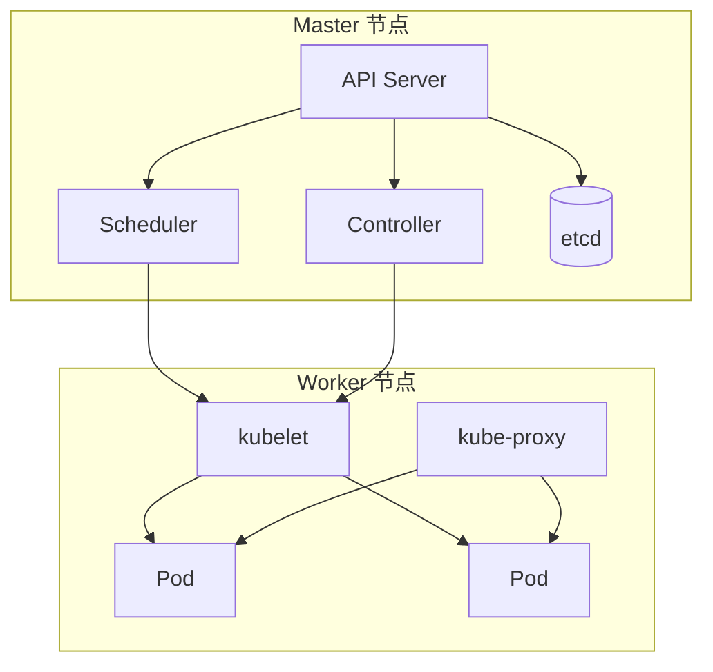

# Kubernetes 核心概念

## 从架构到实践的完整指南

<div class="pt-12">
  <span @click="$slidev.nav.next" class="px-2 py-1 rounded cursor-pointer" hover="bg-white bg-opacity-10">
    按空格键继续 <carbon:arrow-right class="inline"/>
  </span>
</div>

<div class="abs-br m-6 flex gap-2">
  <span class="text-sm opacity-50">作者 | 2026.03.28</span>
</div>

---
layout: section
---

# 本期内容

<div class="grid grid-cols-2 gap-4 pt-8">

<div>

## 01 核心架构组件
## 02 工作负载资源
## 03 服务发现与负载均衡

</div>

<div>

## 04 存储管理
## 05 配置与密钥
## 06 元数据与权限

</div>

</div>

---
layout: two-cols
---

# 集群架构概览

Kubernetes 集群由 **Master** 节点和 **Worker** 节点组成

- **Master**：集群的大脑，负责管理和决策
- **Node**：集群的工人，真正运行业务应用
- **etcd**：集群的数据库，保存所有状态
- **容器运行时**：Docker、containerd 等

::right::



---
layout: section
---

# 01

## 核心架构组件

---
layout: two-cols
---

# Master 组件

<div class="space-y-4">

<div class="bg-cyan-500/10 border border-cyan-500/30 rounded-lg p-4">
  <div class="text-cyan-400 font-bold mb-2">◉ API Server</div>
  <div class="text-sm">集群入口门户，所有操作都通过它</div>
</div>

<div class="bg-purple-500/10 border border-purple-500/30 rounded-lg p-4">
  <div class="text-purple-400 font-bold mb-2">◈ Scheduler</div>
  <div class="text-sm">调度器，决定 Pod 运行在哪个节点</div>
</div>

<div class="bg-pink-500/10 border border-pink-500/30 rounded-lg p-4">
  <div class="text-pink-400 font-bold mb-2">◆ Controller</div>
  <div class="text-sm">控制器，确保实际状态向期望状态靠拢</div>
</div>

<div class="bg-orange-500/10 border border-orange-500/30 rounded-lg p-4">
  <div class="text-orange-400 font-bold mb-2">▣ etcd</div>
  <div class="text-sm">键值数据库，保存所有集群数据</div>
</div>

</div>

::right::

# Master 工作流程

````md magic-move {lines: true}
```yaml {*|1-4}
# 用户提交 Deployment
apiVersion: apps/v1
kind: Deployment
metadata:
  name: nginx
```

```yaml {5-10|*}
spec:
  replicas: 3
  selector:
    matchLabels:
      app: nginx
  template:
    metadata:
      labels:
        app: nginx
```

```yaml {11-15|*}
    spec:
      containers:
      - name: nginx
        image: nginx:1.21
        ports:
        - containerPort: 80
```
````
```

<!--
API Server 接收请求 → etcd 保存数据 → Controller 监听变化 → Scheduler 选择节点
-->

---
layout: two-cols
---

# Node 组件

<div class="space-y-4">

<div class="bg-cyan-500/10 border border-cyan-500/30 rounded-lg p-4">
  <div class="text-cyan-400 font-bold mb-2">◉ kubelet</div>
  <div class="text-sm">节点代理，与 Master 通信管理 Pod</div>
</div>

<div class="bg-purple-500/10 border border-purple-500/30 rounded-lg p-4">
  <div class="text-purple-400 font-bold mb-2">◈ kube-proxy</div>
  <div class="text-sm">网络代理，维护节点网络规则</div>
</div>

<div class="bg-pink-500/10 border border-pink-500/30 rounded-lg p-4">
  <div class="text-pink-400 font-bold mb-2">◆ 容器运行时</div>
  <div class="text-sm">Docker/containerd，真正运行容器</div>
</div>

<div class="bg-orange-500/10 border border-orange-500/30 rounded-lg p-4">
  <div class="text-orange-400 font-bold mb-2">▣ Pod</div>
  <div class="text-sm">最小部署单元，一组容器的集合</div>
</div>

</div>

::right::

# kubelet 工作原理

```yaml {monaco} {height: '280px'}
# kubelet 监听 Pod 变化
apiVersion: v1
kind: Pod
metadata:
  name: nginx-pod
spec:
  containers:
  - name: nginx
    image: nginx:1.21
    resources:
      requests:
        memory: "64Mi"
        cpu: "250m"
      limits:
        memory: "128Mi"
        cpu: "500m"
```

---
layout: section
---

# 02

## 工作负载资源

---
layout: center
class: text-center
---

# Pod - 最小部署单元

<div class="text-6xl my-10">
  <div i-carbon:container-services />
</div>

Kubernetes 中最小的部署单元<br>一个或多个容器的组合

<div class="grid grid-cols-2 gap-8 pt-8 text-left mx-20">

<div>

- **共享网络**：同一 Pod 内容器共享网络命名空间
- **共享存储**：可以挂载共享卷

</div>

<div>

- **同生共死**：一起调度、一起销毁
- **类比**：一个"逻辑主机"，里面运行紧密协作的进程

</div>

</div>

---
layout: two-cols
---

# Pod 定义示例

```yaml {1-5|7-10|12-15|all}{lines:true}
apiVersion: v1
kind: Pod
metadata:
  name: web-pod
  labels:
    app: web
spec:
  containers:
  - name: nginx
    image: nginx:1.21
    ports:
    - containerPort: 80
  - name: sidecar
    image: log-collector:latest
```

::right::

# 多容器 Pod

```yaml {monaco}
apiVersion: v1
kind: Pod
metadata:
  name: multi-container-pod
spec:
  containers:
  - name: app
    image: myapp:v1
  - name: log-agent
    image: fluentd:v1
    volumeMounts:
    - name: log-volume
      mountPath: /var/log
  volumes:
  - name: log-volume
    emptyDir: {}
```

---
layout: two-cols
---

# Deployment

**无状态应用管理**

<div class="space-y-2 text-sm mt-4">

- ✅ 副本数可伸缩
- ✅ 滚动更新
- ✅ Pod 身份不固定
- ✅ 适合 Web 服务、API

</div>

```yaml {2,3,7,8}
apiVersion: apps/v1
kind: Deployment
metadata:
  name: nginx-deployment
spec:
  replicas: 3
  selector:
    matchLabels:
      app: nginx
  template:
    metadata:
      labels:
        app: nginx
    spec:
      containers:
      - name: nginx
        image: nginx:1.21
```

::right::

# StatefulSet

**有状态应用管理**

<div class="space-y-2 text-sm mt-4">

- ✅ 稳定的网络标识
- ✅ 持久化存储
- ✅ 有序部署和扩展
- ✅ 适合数据库、缓存

</div>

```yaml {2,3,10,11}
apiVersion: apps/v1
kind: StatefulSet
metadata:
  name: mysql-statefulset
spec:
  serviceName: mysql
  replicas: 3
  selector:
    matchLabels:
      app: mysql
  template:
    metadata:
      labels:
        app: mysql
    spec:
      containers:
      - name: mysql
        image: mysql:8.0
```

---
layout: center
---

# 其他工作负载类型

<div class="grid grid-cols-4 gap-6 pt-8">

<div class="text-center">
  <div class="text-5xl mb-4 text-cyan-400">◉</div>
  <div class="font-bold">DaemonSet</div>
  <div class="text-sm opacity-70">每个节点运行一个 Pod 副本</div>
</div>

<div class="text-center">
  <div class="text-5xl mb-4 text-purple-400">◈</div>
  <div class="font-bold">Job</div>
  <div class="text-sm opacity-70">一次性任务，完成后退出</div>
</div>

<div class="text-center">
  <div class="text-5xl mb-4 text-pink-400">◆</div>
  <div class="font-bold">CronJob</div>
  <div class="text-sm opacity-70">定时任务，按计划周期执行</div>
</div>

<div class="text-center">
  <div class="text-5xl mb-4 text-orange-400">▣</div>
  <div class="font-bold">ReplicaSet</div>
  <div class="text-sm opacity-70">维持指定数量的 Pod 副本</div>
</div>

</div>

---
layout: two-cols
---

# DaemonSet 使用场景

确保每个节点上都运行一个 Pod 副本的控制器

<div class="space-y-3 mt-4">

<div class="flex items-center gap-3">
  <div i-carbon:chart-line-data text-cyan-400 text-2xl />
  <div>
    <div class="font-bold">日志收集</div>
    <div class="text-sm opacity-70">Fluentd、Filebeat</div>
  </div>
</div>

<div class="flex items-center gap-3">
  <div i-carbon:monitor text-purple-400 text-2xl />
  <div>
    <div class="font-bold">监控采集</div>
    <div class="text-sm opacity-70">Prometheus Node Exporter</div>
  </div>
</div>

<div class="flex items-center gap-3">
  <div i-carbon:network text-pink-400 text-2xl />
  <div>
    <div class="font-bold">网络插件</div>
    <div class="text-sm opacity-70">Calico、Flannel</div>
  </div>
</div>

<div class="flex items-center gap-3">
  <div i-carbon:data-volume text-orange-400 text-2xl />
  <div>
    <div class="font-bold">存储插件</div>
    <div class="text-sm opacity-70">Ceph、GlusterFS</div>
  </div>
</div>

</div>

::right::

# DaemonSet 示例

```yaml {monaco}
apiVersion: apps/v1
kind: DaemonSet
metadata:
  name: log-collector
  namespace: kube-system
spec:
  selector:
    matchLabels:
      app: fluentd
  template:
    metadata:
      labels:
        app: fluentd
    spec:
      tolerations:
      - key: node-role.kubernetes.io/master
        effect: NoSchedule
      containers:
      - name: fluentd
        image: fluentd:v1.14
        volumeMounts:
        - name: varlog
          mountPath: /var/log
      volumes:
      - name: varlog
        hostPath:
          path: /var/log
```

---
layout: section
---

# 03

## 服务发现与负载均衡

---
layout: two-cols
---

# Service 核心概念

将一组 Pod 暴露为**网络服务**的抽象方式

<div class="space-y-2 text-sm mt-4">

- 🔒 **固定入口**：Pod IP 会变化，Service 提供稳定访问点
- ⚖️ **负载均衡**：自动将请求分发到后端 Pod
- 🔍 **服务发现**：通过 DNS 名称访问服务
- 🔗 **解耦**：前端不需要知道后端 Pod 的具体 IP

</div>

```yaml {4-7|9-13|15-18|all}
apiVersion: v1
kind: Service
metadata:
  name: nginx-service
spec:
  selector:
    app: nginx
  ports:
  - protocol: TCP
    port: 80
    targetPort: 8080
  type: ClusterIP
```

::right::

# Service 类型对比

| 类型 | 访问范围 | 使用场景 |
|-----|---------|---------|
| **ClusterIP** | 集群内部 | 内部服务通信 |
| **NodePort** | 节点IP:端口 | 开发测试环境 |
| **LoadBalancer** | 外部负载均衡 | 生产环境暴露 |
| **ExternalName** | 外部域名映射 | 访问外部服务 |

```yaml {2-6|8-12|14-16|all}
apiVersion: v1
kind: Service
metadata:
  name: web-service
spec:
  type: LoadBalancer
  selector:
    app: web
  ports:
  - port: 80
    targetPort: 8080
  externalIPs:
  - 192.168.1.100
```

---
layout: two-cols
---

# Ingress - 七层路由

管理集群外部访问集群内部服务的 API 对象

<div class="space-y-2 text-sm mt-4">

- 🌐 **7层负载**：基于域名、URL 路径的路由
- 🔐 **SSL 终止**：统一处理 HTTPS 证书
- 🏠 **虚拟主机**：一个 IP 托管多个服务
- ⚙️ **需要控制器**：Nginx Ingress、Traefik 等

</div>

::right::

# Ingress 示例

```yaml {monaco}
apiVersion: networking.k8s.io/v1
kind: Ingress
metadata:
  name: web-ingress
  annotations:
    nginx.ingress.kubernetes.io/rewrite-target: /
    cert-manager.io/cluster-issuer: "letsencrypt-prod"
spec:
  ingressClassName: nginx
  tls:
  - hosts:
    - example.com
    secretName: web-tls
  rules:
  - host: example.com
    http:
      paths:
      - path: /
        pathType: Prefix
        backend:
          service:
            name: web-service
            port:
              number: 80
```

---
layout: section
---

# 04

## 存储管理

---
layout: two-cols
---

# 存储核心概念

<div class="space-y-4">

<div class="bg-cyan-500/10 border border-cyan-500/30 rounded-lg p-4">
  <div class="text-cyan-400 font-bold mb-2">◉ Volume</div>
  <div class="text-sm">Pod 内容器共享的存储目录</div>
</div>

<div class="bg-purple-500/10 border border-purple-500/30 rounded-lg p-4">
  <div class="text-purple-400 font-bold mb-2">◈ PV（持久卷）</div>
  <div class="text-sm">管理员准备的存储资源</div>
</div>

<div class="bg-pink-500/10 border border-pink-500/30 rounded-lg p-4">
  <div class="text-pink-400 font-bold mb-2">◆ PVC（持久卷声明）</div>
  <div class="text-sm">用户对存储的申请</div>
</div>

<div class="bg-orange-500/10 border border-orange-500/30 rounded-lg p-4">
  <div class="text-orange-400 font-bold mb-2">▣ StorageClass</div>
  <div class="text-sm">存储类型模板，动态创建 PV</div>
</div>

</div>

::right::

# PV 与 PVC 关系

````md magic-move
```yaml {1-6}
# PV - 管理员准备的资源
apiVersion: v1
kind: PersistentVolume
metadata:
  name: pv-data
spec:
  capacity:
    storage: 10Gi
  accessModes:
  - ReadWriteOnce
```

```yaml {7-12}
  persistentVolumeReclaimPolicy: Retain
  storageClassName: manual
  hostPath:
    path: /mnt/data
```

```yaml {14-22}
# PVC - 用户的存储申请
apiVersion: v1
kind: PersistentVolumeClaim
metadata:
  name: pvc-data
spec:
  accessModes:
  - ReadWriteOnce
  resources:
    requests:
      storage: 5Gi
```
````
```

---
layout: two-cols
---

# StorageClass 动态供给

定义存储的类型模板，实现 PV 的动态创建

<div class="space-y-2 text-sm mt-4">

- 🔄 **按需创建**：创建 PVC 时自动创建 PV
- 📦 **类型定义**：关联 SSD、HDD 等存储类型
- 🗑️ **回收策略**：Delete 或 Retain
- 🔓 **解耦应用**：开发者无需关心底层存储实现

</div>

::right::

# StorageClass 示例

```yaml {monaco}
apiVersion: storage.k8s.io/v1
kind: StorageClass
metadata:
  name: fast-ssd
provisioner: kubernetes.io/aws-ebs
parameters:
  type: io1
  iopsPerGB: "10"
  fsType: ext4
reclaimPolicy: Delete
volumeBindingMode: WaitForFirstConsumer
allowVolumeExpansion: true
---
apiVersion: v1
kind: PersistentVolumeClaim
metadata:
  name: pvc-fast
spec:
  storageClassName: fast-ssd
  accessModes:
  - ReadWriteOnce
  resources:
    requests:
      storage: 10Gi
```

---
layout: section
---

# 05

## 配置与密钥

---
layout: two-cols
---

# ConfigMap vs Secret

<div class="space-y-4">

<div class="bg-blue-500/10 border border-blue-500/30 rounded-lg p-4">
  <div class="text-blue-400 font-bold mb-2">📄 ConfigMap</div>
  <div class="text-sm">非敏感配置数据</div>
  <div class="text-xs opacity-70 mt-2">
    - 配置文件内容<br>
    - 环境变量<br>
    - 命令行参数<br>
    - 明文存储
  </div>
</div>

<div class="bg-red-500/10 border border-red-500/30 rounded-lg p-4">
  <div class="text-red-400 font-bold mb-2">🔒 Secret</div>
  <div class="text-sm">敏感信息数据</div>
  <div class="text-xs opacity-70 mt-2">
    - 密码、Token<br>
    - SSH 密钥<br>
    - OAuth 令牌<br>
    - Base64 编码
  </div>
</div>

</div>

::right::

# ConfigMap 示例

```yaml {monaco}
# 创建 ConfigMap
apiVersion: v1
kind: ConfigMap
metadata:
  name: app-config
data:
  app.properties: |
    server.port=8080
    server.address=0.0.0.0
  database.url: "postgresql://localhost:5432/mydb"
---
# 在 Pod 中使用
apiVersion: v1
kind: Pod
metadata:
  name: config-pod
spec:
  containers:
  - name: app
    image: myapp:v1
    envFrom:
    - configMapRef:
        name: app-config
    volumeMounts:
    - name: config
      mountPath: /etc/config
  volumes:
  - name: config
    configMap:
      name: app-config
```

---
layout: two-cols
---

# Secret 示例

```yaml {1-9|11-19|all}
apiVersion: v1
kind: Secret
metadata:
  name: db-secret
type: Opaque
data:
  username: YWRtaW4=  # admin
  password: cGFzc3dvcmQ=  # password
---
apiVersion: v1
kind: Pod
metadata:
  name: secret-pod
spec:
  containers:
  - name: app
    image: myapp:v1
    env:
    - name: DB_USERNAME
      valueFrom:
        secretKeyRef:
          name: db-secret
          key: username
    - name: DB_PASSWORD
      valueFrom:
        secretKeyRef:
          name: db-secret
          key: password
```

::right::

# Secret 类型

```yaml {2,5|8,11|14,16|all}
# Opaque - 通用密钥
apiVersion: v1
kind: Secret
type: Opaque
data:
  password: cGFzc3dvcmQ=

# TLS - HTTPS 证书
apiVersion: v1
kind: Secret
type: kubernetes.io/tls
data:
  tls.crt: LS0tLS1CRUdJTi...
  tls.key: LS0tLS1CRUdJTi...

# Docker Registry - 镜像拉取凭证
apiVersion: v1
kind: Secret
type: kubernetes.io/dockerconfigjson
data:
  .dockerconfigjson: eyJhdXRocyI6e319
```

---
layout: section
---

# 06

## 元数据与权限

---
layout: two-cols
---

# Namespace 资源隔离

在同一个物理集群内实现资源隔离的虚拟集群

<div class="space-y-2 text-sm mt-4">

- 🏢 **环境隔离**：dev、test、prod 环境分开
- 👥 **团队隔离**：不同团队使用不同命名空间
- 📊 **资源配额**：可限制每个 Namespace 的资源使用
- 🔐 **访问控制**：可针对 Namespace 设置权限

</div>

```yaml {2-4|6-9|11-14|all}
# 创建 Namespace
apiVersion: v1
kind: Namespace
metadata:
  name: production
---
# 资源配额
apiVersion: v1
kind: ResourceQuota
metadata:
  name: compute-quota
  namespace: production
spec:
  hard:
    requests.cpu: "10"
    requests.memory: 20Gi
    limits.cpu: "20"
    limits.memory: 40Gi
```

::right::

# Label 与 Selector

```yaml {monaco}
# 为资源打标签
apiVersion: apps/v1
kind: Deployment
metadata:
  name: nginx-deployment
  labels:
    app: nginx
    env: production
    tier: frontend
spec:
  selector:
    matchLabels:
      app: nginx
  template:
    metadata:
      labels:
        app: nginx
        env: production
---
# 使用 Selector 筛选
apiVersion: v1
kind: Service
metadata:
  name: nginx-service
spec:
  selector:
    app: nginx      # 匹配标签
    env: production
```

---
layout: two-cols
---

# RBAC 权限模型

| 组件 | 作用范围 | 功能 |
|-----|---------|-----|
| **Role** | Namespace | 定义命名空间内权限 |
| **ClusterRole** | 集群 | 定义集群级别权限 |
| **RoleBinding** | Namespace | 绑定角色到用户 |
| **ClusterRoleBinding** | 集群 | 绑定集群角色到用户 |

```yaml {monaco}
# 定义 Role
apiVersion: rbac.authorization.k8s.io/v1
kind: Role
metadata:
  name: pod-reader
rules:
- apiGroups: [""]
  resources: ["pods"]
  verbs: ["get", "watch", "list"]
---
# 绑定到用户
apiVersion: rbac.authorization.k8s.io/v1
kind: RoleBinding
metadata:
  name: read-pods
subjects:
- kind: User
  name: jane
  apiGroup: rbac.authorization.k8s.io
roleRef:
  kind: Role
  name: pod-reader
  apiGroup: rbac.authorization.k8s.io
```

::right::

# ServiceAccount

```yaml {1-6|8-14|16-21|all}
apiVersion: v1
kind: ServiceAccount
metadata:
  name: build-robot
  namespace: default
---
apiVersion: v1
kind: Pod
metadata:
  name: my-pod
spec:
  serviceAccountName: build-robot
  containers:
  - name: my-container
    image: myapp:v1
---
# 绑定权限
apiVersion: rbac.authorization.k8s.io/v1
kind: RoleBinding
metadata:
  name: build-robot-binding
subjects:
- kind: ServiceAccount
  name: build-robot
roleRef:
  kind: Role
  name: pod-reader
  apiGroup: rbac.authorization.k8s.io
```

---
layout: section
---

# 典型工作流程

---
layout: center
class: text-center
---

# 部署一个应用的完整流程

<div class="mt-12">

````md magic-move {lines: true}
```yaml {1-3}
# 1. 创建 Deployment
apiVersion: apps/v1
kind: Deployment
metadata:
  name: web-app
```

```yaml {4-8}
spec:
  replicas: 3
  selector:
    matchLabels:
      app: web
  template:
    metadata:
      labels:
        app: web
```

```yaml {9-15}
    spec:
      containers:
      - name: nginx
        image: nginx:1.21
        ports:
        - containerPort: 80
        env:
        - name: DB_HOST
          valueFrom:
            configMapKeyRef:
              name: app-config
              key: database.url
```

```yaml {16-22}
# 2. 创建 Service
apiVersion: v1
kind: Service
metadata:
  name: web-service
spec:
  selector:
    app: web
  ports:
  - port: 80
    targetPort: 80
  type: ClusterIP
```

```yaml {23-35}
# 3. 创建 Ingress
apiVersion: networking.k8s.io/v1
kind: Ingress
metadata:
  name: web-ingress
spec:
  rules:
  - host: example.com
    http:
      paths:
      - path: /
        pathType: Prefix
        backend:
          service:
            name: web-service
            port:
              number: 80
```
````
```

</div>

---
layout: quote
---

# 设计哲学

> Kubernetes 让开发者专注于应用本身，而不是基础设施的复杂性。

<div class="text-sm opacity-70 mt-8">
  — K8s 设计理念
</div>

---
layout: section
---

# 核心概念回顾

---
layout: center
class: text-center
---

# 核心概念回顾

<div class="grid grid-cols-4 gap-8 pt-12">

<div class="space-y-2">
  <div class="text-5xl text-cyan-400">◉</div>
  <div class="font-bold">架构</div>
  <div class="text-sm opacity-70">Master + Node<br>控制与工作分离</div>
</div>

<div class="space-y-2">
  <div class="text-5xl text-purple-400">◈</div>
  <div class="font-bold">工作负载</div>
  <div class="text-sm opacity-70">Pod、Deployment<br>StatefulSet</div>
</div>

<div class="space-y-2">
  <div class="text-5xl text-pink-400">◆</div>
  <div class="font-bold">网络</div>
  <div class="text-sm opacity-70">Service、Ingress<br>服务发现</div>
</div>

<div class="space-y-2">
  <div class="text-5xl text-orange-400">▣</div>
  <div class="font-bold">存储</div>
  <div class="text-sm opacity-70">PV、PVC<br>StorageClass</div>
</div>

</div>

---
layout: end
class: text-center
---

# 感谢观看

<div class="text-6xl my-10">
  <div i-carbon:thumbs-up />
</div>

## 点赞关注不迷路

<div class="mt-12 opacity-50">
  作者 | B站/公众号
</div>

---
layout: center
class: text-center
---

# 实战练习

<div class="mt-12">

```yaml {monaco-run} {autorun: false}
# 尝试运行以下 kubectl 命令

# 创建 Deployment
kubectl create deployment nginx --image=nginx

# 暴露服务
kubectl expose deployment nginx --port=80 --type=NodePort

# 查看 Pod
kubectl get pods

# 查看 Service
kubectl get services

# 查看 Deployment 详情
kubectl describe deployment nginx

# 扩容到 3 个副本
kubectl scale deployment nginx --replicas=3

# 删除 Deployment
kubectl delete deployment nginx
```

</div>

<!--
这些命令可以在本地 k8s 环境或 minikube 中运行
-->
