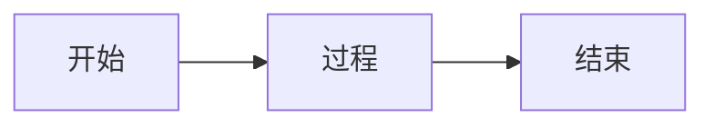

# Slidev 布局模式指南

为每种 Slidev 内置布局提供完整的 Markdown 模板。

---

## Headmatter 完整配置（全局）

第一张幻灯片的 frontmatter 同时作为全局配置（headmatter）：

```yaml
---
layout: center
highlighter: shiki
css: unocss
colorSchema: dark
transition: fade-out
title: 演示标题
exportFilename: 导出文件名
lineNumbers: false
drawings:
  persist: false
mdc: true
---
```

### 常用 headmatter 选项

| 选项 | 说明 | 示例 |
|------|------|------|
| `theme` | 主题名 | `default`, `seriph` |
| `title` | 演示文稿标题 | `我的演讲` |
| `highlighter` | 代码高亮器 | `shiki` |
| `css` | CSS 框架 | `unocss` |
| `colorSchema` | 颜色模式 | `dark`, `light`, `auto` |
| `transition` | 默认过渡动画 | `fade-out` |
| `lineNumbers` | 显示行号 | `true`/`false` |
| `drawings.persist` | 保存绘图 | `true`/`false` |
| `mdc` | 启用 MDC 语法 | `true` |
| `fonts` | 自定义字体 | `sans: 'DM Sans'` |
| `aspectRatio` | 画面比例 | `16/9` |
| `canvasWidth` | 画布宽度 | `980` |
| `download` | PDF下载按钮 | `true`/`false` |
| `exportFilename` | 导出文件名 | `my-slides` |

### Per-Slide Frontmatter 选项

| 选项 | 说明 | 示例 |
|------|------|------|
| `layout` | 布局类型 | `center`, `two-cols` |
| `transition` | 本页过渡 | `slide-left` |
| `background` | 背景图片 | `/bg.jpg` |
| `class` | CSS 类 | `text-white text-center` |
| `clicks` | 点击次数 | `5` |
| `zoom` | 缩放比例 | `0.8` |
| `disabled` | 隐藏本页 | `true` |
| `hideInToc` | 从目录隐藏 | `true` |
| `src` | 导入外部文件 | `./intro.md` |
| `glow` | Glow分布(glow主题) | `left`, `right`, `full` |
| `glowOpacity` | Glow透明度 | `0.4` |
| `glowHue` | Glow色调偏移 | `30` |
| `glowSeed` | Glow随机种子 | `my-seed` |

---

## 布局模板

### center — 居中（封面页）

```markdown
---
layout: center
---

# 演讲标题

<div class="abs-br m-6 text-sm opacity-50">
  演讲者 · 日期
</div>
```

### section — 章节分隔

```markdown
---
layout: section
---

# 01

章节名称
```

### default — 标准内容（默认）

```markdown
---
---

## 观点标题

- 论据一
- 论据二
- 论据三

<!-- 演讲者备注 -->
```

### two-cols — 双栏对比

```markdown
---
layout: two-cols
---

## 方案 A

- 优点一
- 优点二

::right::

## 方案 B

- 优点一
- 优点二
```

### two-cols-header — 带标题双栏

```markdown
---
layout: two-cols-header
---

## 对比标题

::left::

### 左侧
内容

::right::

### 右侧
内容
```

### image-left — 左图右文

```markdown
---
layout: image-left
image: /photo.jpg
---

## 标题

说明文字
```

### image-right — 左文右图

```markdown
---
layout: image-right
image: /photo.jpg
---

## 标题

说明文字
```

### image — 全屏图片

```markdown
---
layout: image
image: /photo.jpg
backgroundSize: cover
class: text-white
---
```

### iframe — 嵌入网页

```markdown
---
layout: iframe
url: https://example.com
---
```

### quote — 引用

```markdown
---
layout: quote
---

> 名言内容

— 作者
```

### fact — 数据展示

```markdown
---
layout: fact
---

## 93%

关键数据说明
```

### statement — 核心陈述

```markdown
---
layout: statement
---

## 核心结论

一句话总结
```

### intro — 介绍页

```markdown
---
layout: intro
---

# 演讲标题

演讲副标题或描述

<div class="abs-br m-6">
  演讲者信息
</div>
```

### end — 结束页

```markdown
---
layout: end
---

感谢观看！

联系方式或二维码
```

---

## 高级布局模板（自定义组合布局）

以下布局通过 `default` 布局 + UnoCSS + Vue 指令组合实现，适用于技术分享高频场景。

### card-grid — 卡片网格

列举特性、功能清单、工具一览。支持 2x2 / 2x3 / 3x3 等网格。

```markdown
---
class: py-10
clicks: 4
---

## 核心特性

<div grid grid-cols-2 gap-4 mt-8>

<v-clicks>

<div border="2 solid violet-800/50" rounded-lg overflow-hidden bg="violet-900/10" backdrop-blur-sm>
  <div flex items-center bg="violet-800/30" px-3 py-2 text-violet-300>
    <div i-carbon:text-creation text-sm mr-2 />
    <div font-semibold>特性 A</div>
  </div>
  <div bg="violet-900/5" px-4 py-3>
    <div text-sm>特性描述文字</div>
    <div class="text-xs opacity-70">补充说明</div>
  </div>
</div>

<div border="2 solid blue-800/50" rounded-lg overflow-hidden bg="blue-900/10" backdrop-blur-sm>
  <div flex items-center bg="blue-800/30" px-3 py-2 text-blue-300>
    <div i-carbon:image-search text-sm mr-2 />
    <div font-semibold>特性 B</div>
  </div>
  <div bg="blue-900/5" px-4 py-3>
    <div text-sm>特性描述文字</div>
    <div class="text-xs opacity-70">补充说明</div>
  </div>
</div>

<div border="2 solid green-800/50" rounded-lg overflow-hidden bg="green-900/10" backdrop-blur-sm>
  <div flex items-center bg="green-800/30" px-3 py-2 text-green-300>
    <div i-carbon:model-alt text-sm mr-2 />
    <div font-semibold>特性 C</div>
  </div>
  <div bg="green-900/5" px-4 py-3>
    <div text-sm>特性描述文字</div>
    <div class="text-xs opacity-70">补充说明</div>
  </div>
</div>

<div border="2 solid amber-800/50" rounded-lg overflow-hidden bg="amber-900/10" backdrop-blur-sm>
  <div flex items-center bg="amber-800/30" px-3 py-2 text-amber-300>
    <div i-carbon:connect text-sm mr-2 />
    <div font-semibold>特性 D</div>
  </div>
  <div bg="amber-900/5" px-4 py-3>
    <div text-sm>特性描述文字</div>
    <div class="text-xs opacity-70">补充说明</div>
  </div>
</div>

</v-clicks>

</div>
```

**三列变体**：将 `grid-cols-2` 改为 `grid-cols-3`，每张卡片内描述可精简为单行。

---

### steps-pipeline — 流程/步骤

展示多步骤流程：CI/CD 管道、请求链路、数据处理流。水平排列，带箭头连接。

```markdown
---
class: py-10
clicks: 4
---

## 请求处理流程

<span class="text-sm opacity-70">从接收到响应的完整链路</span>

<div mt-8 />

<div flex items-center gap-4>

<v-clicks>

<div
  rounded-lg border="2 solid violet-900" bg="violet-900/20"
  backdrop-blur flex-1 transition duration-500 ease-in-out
>
  <div px-5 py-8 flex items-center justify-center>
    <div i-carbon:request-quote text-4xl />
  </div>
  <div bg="violet-900/30" w-full px-4 py-2 flex items-center justify-center text-center>
    <span text-sm>接收请求</span>
  </div>
</div>

<div text-2xl class="opacity-30">→</div>

<div
  rounded-lg border="2 solid blue-800" bg="blue-800/20"
  backdrop-blur flex-1 transition duration-500 ease-in-out
>
  <div px-5 py-8 flex items-center justify-center>
    <div i-carbon:settings text-4xl />
  </div>
  <div bg="blue-800/30" w-full px-4 py-2 flex items-center justify-center text-center>
    <span text-sm>中间件处理</span>
  </div>
</div>

<div text-2xl class="opacity-30">→</div>

<div
  rounded-lg border="2 solid green-800" bg="green-800/20"
  backdrop-blur flex-1 transition duration-500 ease-in-out
>
  <div px-5 py-8 flex items-center justify-center>
    <div i-carbon:data-base text-4xl />
  </div>
  <div bg="green-800/30" w-full px-4 py-2 flex items-center justify-center text-center>
    <span text-sm>数据查询</span>
  </div>
</div>

<div text-2xl class="opacity-30">→</div>

<div
  rounded-lg border="2 solid amber-800" bg="amber-800/20"
  backdrop-blur flex-1 transition duration-500 ease-in-out
>
  <div px-5 py-8 flex items-center justify-center>
    <div i-carbon:send text-4xl />
  </div>
  <div bg="amber-800/30" w-full px-4 py-2 flex items-center justify-center text-center>
    <span text-sm>返回响应</span>
  </div>
</div>

</v-clicks>

</div>
```

**紧凑变体**：去掉图标区域（`py-8` → `py-3`），步骤较多（5-6步）时使用。

---

### code-focus — 代码聚焦讲解

逐行/逐段讲解代码，左侧代码 + 右侧要点注释。

```markdown
---
class: py-8
clicks: 3
---

## 核心实现：响应式代理

<div grid grid-cols-5 gap-6 mt-6>
<div col-span-3>

```ts {1-3|5-8|10-12}{maxHeight:'350px'}
// 创建响应式对象的入口
function reactive(target) {
  return createReactiveObject(target)
}

// 使用 Proxy 拦截读写操作
function createReactiveObject(target) {
  const proxy = new Proxy(target, handlers)
  return proxy
}

// 依赖收集：get 时记录当前 effect
track(target, key)
```

</div>
<div col-span-2>

<div
  v-click="1"
  transition duration-300
  :class="$clicks < 1 ? 'opacity-30' : 'opacity-100'"
  border-l-2 border-violet-500 pl-4 mb-6
>
  <div text-sm font-bold text-violet-300>入口函数</div>
  <div text-xs mt-1>对外暴露的简洁 API，隐藏内部实现</div>
</div>

<div
  v-click="2"
  transition duration-300
  :class="$clicks < 2 ? 'opacity-30' : 'opacity-100'"
  border-l-2 border-blue-500 pl-4 mb-6
>
  <div text-sm font-bold text-blue-300>Proxy 拦截</div>
  <div text-xs mt-1>ES6 Proxy 实现对属性的完全监控</div>
</div>

<div
  v-click="3"
  transition duration-300
  :class="$clicks < 3 ? 'opacity-30' : 'opacity-100'"
  border-l-2 border-green-500 pl-4
>
  <div text-sm font-bold text-green-300>依赖收集</div>
  <div text-xs mt-1>读取时自动追踪谁在使用这个值</div>
</div>

</div>
</div>
```

**全宽变体**：去掉右侧注释栏，代码占满宽度，下方用 `v-clicks` 列表补充讲解要点。

---

### comparison — 对比布局

新旧方案、A/B 技术选型对比，每侧可嵌入代码块。

```markdown
---
class: py-10
clicks: 2
---

## 传统方案 vs 新方案

<div grid grid-cols-2 gap-8 mt-8>
  <div
    v-click="1"
    transition duration-500 ease-in-out
    :class="$clicks < 1 ? 'opacity-0' : 'opacity-100'"
    class="border-2 border-orange-500/30 rounded-lg p-5 bg-orange-500/10"
  >
    <div text-xl font-bold mb-3 text-orange-300>传统方案</div>
    <div text-sm mb-4>手动管理状态，容易出错</div>

```ts
// 手动维护 DOM
document.getElementById('count')
  .textContent = count + 1
```

  </div>
  <div
    v-click="2"
    transition duration-500 ease-in-out
    :class="$clicks < 2 ? 'opacity-0' : 'opacity-100'"
    class="border-2 border-green-500/30 rounded-lg p-5 bg-green-500/10"
  >
    <div text-xl font-bold mb-3 text-green-300>新方案</div>
    <div text-sm mb-4>声明式更新，自动响应</div>

```ts
// 响应式自动更新
const count = ref(0)
count.value++
```

  </div>
</div>
```

**三栏对比**：使用 `grid-cols-3`，适用于三种方案选型。

---

### timeline — 时间线

展示技术演进、版本迭代、项目里程碑。纵向排列。

```markdown
---
class: py-10
clicks: 4
---

## 技术演进历程

<div mt-6 ml-8>

<v-clicks>

<div flex gap-4 mb-6>
  <div flex flex-col items-center>
    <div w-3 h-3 rounded-full bg-violet-500 mt-1.5 />
    <div w-0.5 flex-1 bg="violet-800/30" mt-1 />
  </div>
  <div flex-1 pb-2>
    <div text-sm font-bold text-violet-300>2023 · v1.0 发布</div>
    <div text-xs mt-1>基础框架搭建，支持核心功能</div>
  </div>
</div>

<div flex gap-4 mb-6>
  <div flex flex-col items-center>
    <div w-3 h-3 rounded-full bg-blue-500 mt-1.5 />
    <div w-0.5 flex-1 bg="blue-800/30" mt-1 />
  </div>
  <div flex-1 pb-2>
    <div text-sm font-bold text-blue-300>2024 · v2.0 重构</div>
    <div text-xs mt-1>引入插件系统，性能提升 3x</div>
  </div>
</div>

<div flex gap-4 mb-6>
  <div flex flex-col items-center>
    <div w-3 h-3 rounded-full bg-green-500 mt-1.5 />
    <div w-0.5 flex-1 bg="green-800/30" mt-1 />
  </div>
  <div flex-1 pb-2>
    <div text-sm font-bold text-green-300>2025 · AI 集成</div>
    <div text-xs mt-1>内置 AI 能力，智能代码补全</div>
  </div>
</div>

<div flex gap-4>
  <div flex flex-col items-center>
    <div w-3 h-3 rounded-full bg-amber-500 mt-1.5 />
  </div>
  <div flex-1>
    <div text-sm font-bold text-amber-300>2026 · 生态扩展</div>
    <div text-xs mt-1>开放 API，构建开发者生态</div>
  </div>
</div>

</v-clicks>

</div>
```

---

### architecture — 架构图

用卡片分层展示系统架构。上下层之间用箭头或间距暗示依赖关系。

```markdown
---
class: py-8
clicks: 3
---

## 系统架构

<div flex flex-col items-center gap-3 mt-6>

<v-clicks>

<!-- 接入层 -->
<div flex gap-3 w-full max-w-4xl>
  <div flex-1 border="2 solid violet-800/50" rounded-lg bg="violet-900/15" px-4 py-3 text-center>
    <div text-sm font-bold text-violet-300>Web 前端</div>
  </div>
  <div flex-1 border="2 solid violet-800/50" rounded-lg bg="violet-900/15" px-4 py-3 text-center>
    <div text-sm font-bold text-violet-300>移动端 App</div>
  </div>
  <div flex-1 border="2 solid violet-800/50" rounded-lg bg="violet-900/15" px-4 py-3 text-center>
    <div text-sm font-bold text-violet-300>开放 API</div>
  </div>
</div>

<div text-xl class="opacity-30">⬇</div>

<!-- 服务层 -->
<div flex gap-3 w-full max-w-4xl>
  <div flex-1 border="2 solid blue-800/50" rounded-lg bg="blue-900/15" px-4 py-3 text-center>
    <div text-sm font-bold text-blue-300>API Gateway</div>
  </div>
  <div flex-1 border="2 solid blue-800/50" rounded-lg bg="blue-900/15" px-4 py-3 text-center>
    <div text-sm font-bold text-blue-300>业务服务</div>
  </div>
  <div flex-1 border="2 solid blue-800/50" rounded-lg bg="blue-900/15" px-4 py-3 text-center>
    <div text-sm font-bold text-blue-300>消息队列</div>
  </div>
</div>

<div text-xl class="opacity-30">⬇</div>

<!-- 存储层 -->
<div flex gap-3 w-full max-w-4xl>
  <div flex-1 border="2 solid green-800/50" rounded-lg bg="green-900/15" px-4 py-3 text-center>
    <div text-sm font-bold text-green-300>PostgreSQL</div>
  </div>
  <div flex-1 border="2 solid green-800/50" rounded-lg bg="green-900/15" px-4 py-3 text-center>
    <div text-sm font-bold text-green-300>Redis</div>
  </div>
  <div flex-1 border="2 solid green-800/50" rounded-lg bg="green-900/15" px-4 py-3 text-center>
    <div text-sm font-bold text-green-300>对象存储</div>
  </div>
</div>

</v-clicks>

</div>
```

---

### metrics — 指标看板

展示关键数据指标，比 `fact` 布局更灵活，支持多指标并排。

```markdown
---
class: py-10
clicks: 3
---

## 上线后关键指标

<div grid grid-cols-3 gap-6 mt-12>

<div
  v-click="1"
  transition duration-500
  :class="$clicks < 1 ? 'opacity-0 translate-y-5' : 'opacity-100 translate-y-0'"
  text-center
>
  <div text-5xl font-bold text-violet-400>99.9%</div>
  <div text-sm mt-3 opacity-70>服务可用性</div>
</div>

<div
  v-click="2"
  transition duration-500
  :class="$clicks < 2 ? 'opacity-0 translate-y-5' : 'opacity-100 translate-y-0'"
  text-center
>
  <div text-5xl font-bold text-blue-400>12ms</div>
  <div text-sm mt-3 opacity-70>P99 响应时间</div>
</div>

<div
  v-click="3"
  transition duration-500
  :class="$clicks < 3 ? 'opacity-0 translate-y-5' : 'opacity-100 translate-y-0'"
  text-center
>
  <div text-5xl font-bold text-green-400>10M+</div>
  <div text-sm mt-3 opacity-70>日均请求量</div>
</div>

</div>
```

**带趋势变体**：在每个指标下方加一行小字 `↑ 15% vs 上月` 表示趋势。

---

### data-table — 表格数据

性能对比、参数说明、Benchmark 结果展示。

```markdown
---
class: py-10
---

## Benchmark 对比

<div mt-8 />

| 方案 | QPS | P99 延迟 | 内存占用 |
|------|-----|---------|---------|
| 方案 A | 12,000 | 45ms | 256MB |
| 方案 B | 8,500 | 72ms | 512MB |
| **方案 C** | **18,000** | **28ms** | **384MB** |

<div mt-6 text-sm opacity-70>
  测试环境：4C8G · 并发 500 · 持续 60s
</div>
```

---

### faq — 问答/常见问题

演讲结尾互动、Q&A 环节。

```markdown
---
class: py-10
clicks: 3
---

## 常见问题

<div mt-8 flex flex-col gap-6>

<div
  v-click="1"
  transition duration-300
  border="2 solid violet-800/50"
  rounded-lg bg="violet-900/10" px-5 py-4
  :class="$clicks < 1 ? 'opacity-0' : 'opacity-100'"
>
  <div font-bold text-violet-300>Q: 这个方案支持哪些语言？</div>
  <div text-sm mt-2 opacity-80>A: 目前支持 TypeScript、Python、Go 三种语言，后续会扩展更多。</div>
</div>

<div
  v-click="2"
  transition duration-300
  border="2 solid blue-800/50"
  rounded-lg bg="blue-900/10" px-5 py-4
  :class="$clicks < 2 ? 'opacity-0' : 'opacity-100'"
>
  <div font-bold text-blue-300>Q: 生产环境稳定性如何？</div>
  <div text-sm mt-2 opacity-80>A: 已在 3 个核心服务运行超过 6 个月，SLA 达到 99.95%。</div>
</div>

<div
  v-click="3"
  transition duration-300
  border="2 solid green-800/50"
  rounded-lg bg="green-900/10" px-5 py-4
  :class="$clicks < 3 ? 'opacity-0' : 'opacity-100'"
>
  <div font-bold text-green-300>Q: 迁移成本高吗？</div>
  <div text-sm mt-2 opacity-80>A: 提供渐进式迁移方案，新功能用新方案，旧代码无需改动。</div>
</div>

</div>
```

---

### annotated-list — 列表注释

API 参数详解、配置项说明。左侧参数名，右侧说明。

```markdown
---
class: py-10
clicks: 4
---

## 核心配置项

<div mt-6 flex flex-col gap-4>

<v-clicks>

<div flex gap-4 border="2 solid violet-800/30" rounded-lg bg="violet-900/10" px-4 py-3>
  <div w-32 shrink-0>
    <div text-sm font-mono font-bold text-violet-300>model</div>
    <div class="text-xs opacity-50">string</div>
  </div>
  <div flex-1 text-sm>
    指定使用的模型名称，如 <span font-mono text-xs>gpt-4</span>、<span font-mono text-xs>claude-3</span>
  </div>
</div>

<div flex gap-4 border="2 solid blue-800/30" rounded-lg bg="blue-900/10" px-4 py-3>
  <div w-32 shrink-0>
    <div text-sm font-mono font-bold text-blue-300>temperature</div>
    <div class="text-xs opacity-50">number · 0-2</div>
  </div>
  <div flex-1 text-sm>
    控制输出随机性，值越高结果越多样
  </div>
</div>

<div flex gap-4 border="2 solid green-800/30" rounded-lg bg="green-900/10" px-4 py-3>
  <div w-32 shrink-0>
    <div text-sm font-mono font-bold text-green-300>max_tokens</div>
    <div class="text-xs opacity-50">number</div>
  </div>
  <div flex-1 text-sm>
    单次请求最大生成 token 数量
  </div>
</div>

<div flex gap-4 border="2 solid amber-800/30" rounded-lg bg="amber-900/10" px-4 py-3>
  <div w-32 shrink-0>
    <div text-sm font-mono font-bold text-amber-300>stream</div>
    <div class="text-xs opacity-50">boolean</div>
  </div>
  <div flex-1 text-sm>
    是否启用流式输出，实时返回生成内容
  </div>
</div>

</v-clicks>

</div>
```

---

## 常用组件速查

### Link — 页面链接
```html
<Link to="3">跳转到第3页</Link>
<Link to="intro">跳转到别名页</Link>
```

### Toc — 目录
```html
<Toc />
<Toc maxDepth="2" />
```

### VClick — 点击动画
```html
<v-click>
  <div>点击后出现</div>
</v-click>

<v-clicks depth="2">
- 项目一
  - 子项目
- 项目二
</v-clicks>
```

### Arrow — 箭头
```html
<Arrow x1="100" y1="100" x2="400" y2="200" color="green" />
<Arrow v-bind="arrow1" />
```

### Transform — 缩放
```html
<Transform :scale="0.8">
  <div>缩小到80%</div>
</Transform>
```

### Mermaid — 图表
````markdown

````

### LaTeX — 数学公式
```markdown
行内公式: $E = mc^2$

块级公式:
$$
\frac{a}{b} = c
$$
```
